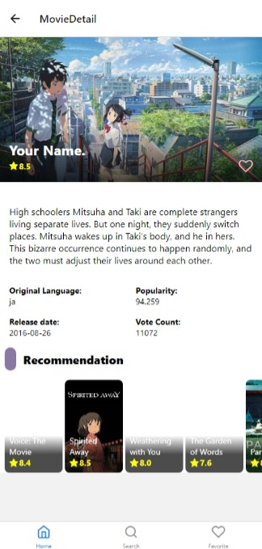
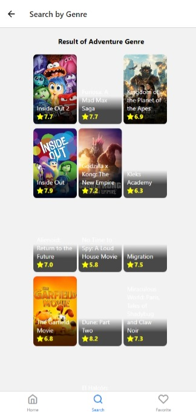

 

# Progate Movie App

This is a React Native application for browsing and searching movies. It allows users to view movie details, watch trailers, and save their favorite movies.

## Features

- Browse popular movies
- Search for movies by title
- View movie details including synopsis, release date, and rating

## Installation

1. Clone the repository: `git clone https://github.com/your-username/progate-movie-app.git`
2. Install dependencies: `npm install`
3. Start the development server: `npm start`

## Environment Variables

To run this application, you need to set the following environment variables:

- `API_ACCESS_TOKEN`: Your API key for accessing movie data.

Please make sure to set these variables before running the application.

## Usage

1. Launch the app on your device or emulator.
2. Browse popular movies on the home screen.
3. Use the search bar to find movies by title.
4. Tap on a movie to view its details.

## Contributing

Contributions are welcome! If you find any bugs or have suggestions for new features, please open an issue or submit a pull request.

## License

This project is licensed under the MIT License. See the [LICENSE](LICENSE) file for more information.

This is a React Native application for browsing and searching movies. It allows users to view movie details, watch trailers, and save their favorite movies.

## Features

- Browse popular movies
- Search for movies by title
- View movie details including synopsis, release date, and rating
- Watch movie trailers
- Save favorite movies

## Installation

1. Clone the repository: `git clone https://github.com/your-username/progate-movie-app.git`
2. Install dependencies: `npm install`
3. Start the development server: `npm start`

## Usage

1. Launch the app on your device or emulator.
2. Browse popular movies on the home screen.
3. Use the search bar to find movies by title.
4. Tap on a movie to view its details.
5. Watch the trailer by tapping on the "Watch Trailer" button.
6. Save your favorite movies by tapping on the heart icon.

## Contributing

Contributions are welcome! If you find any bugs or have suggestions for new features, please open an issue or submit a pull request.

## License

This project is licensed under the MIT License. See the [LICENSE](LICENSE) file for more information.
